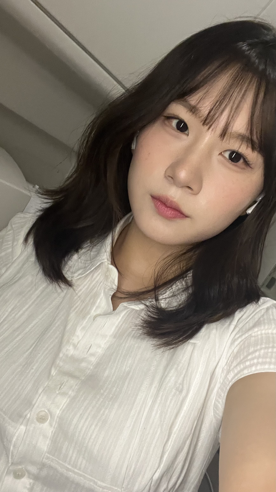
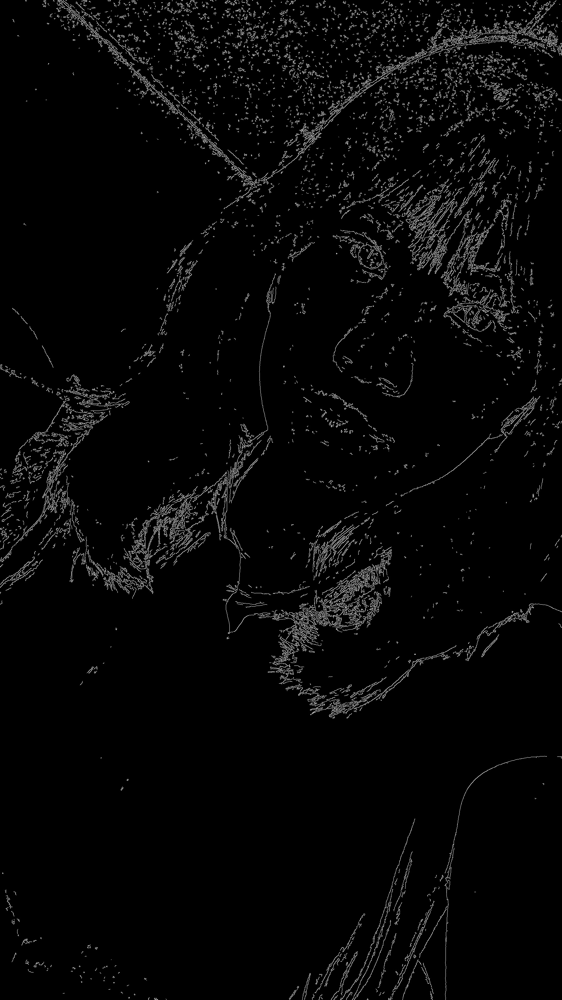
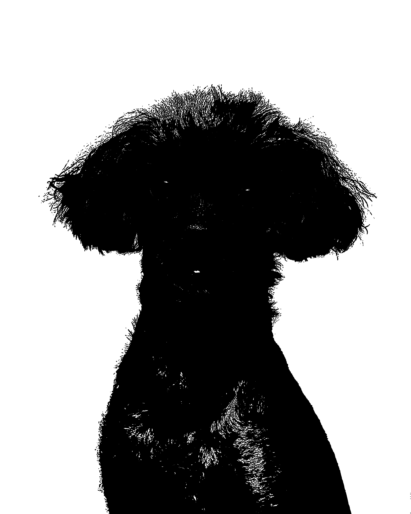
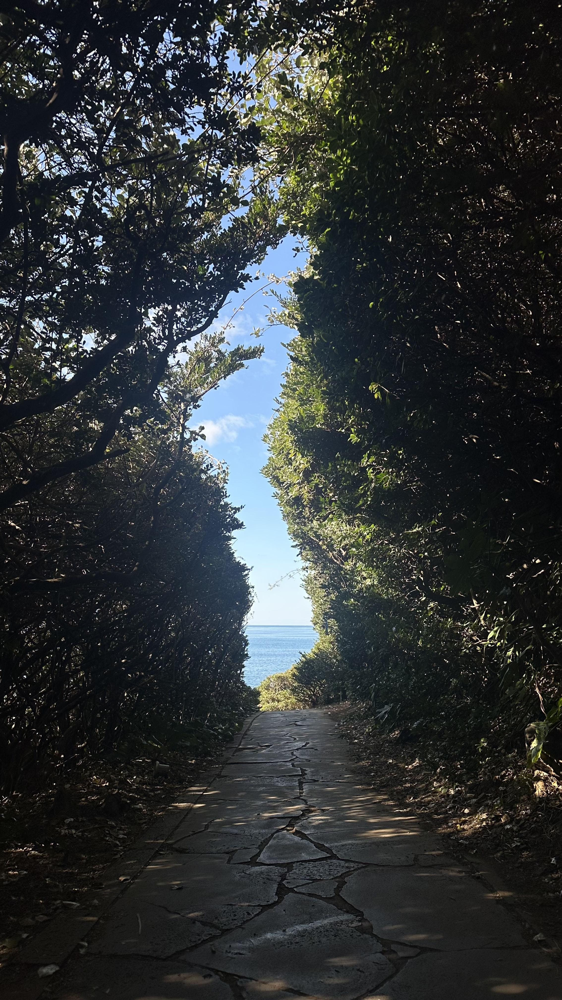
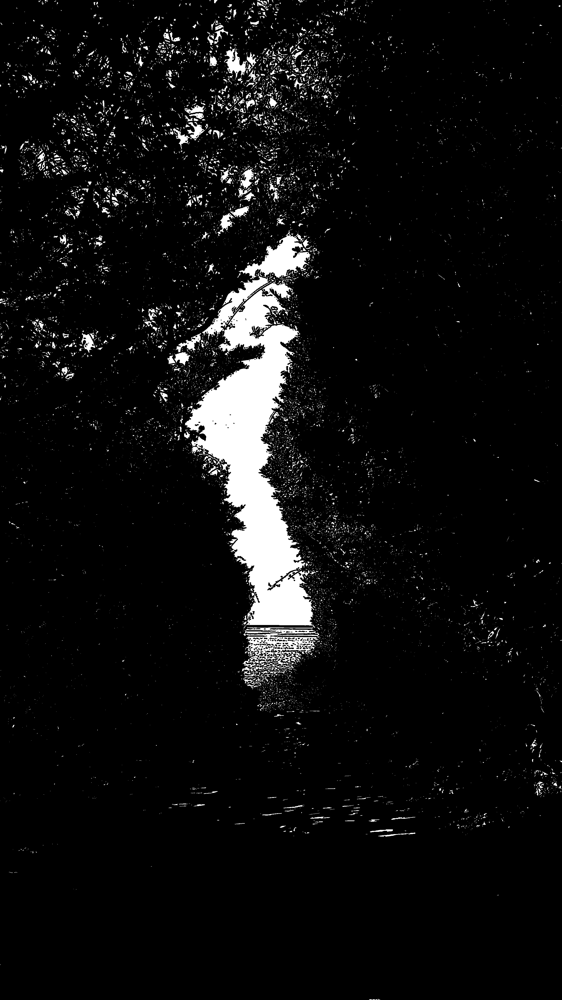

# 🩸 Tomie 스타일 이미지 변환기 (Horror Cartoon Renderer)

이 프로젝트는 OpenCV를 이용하여 일반 이미지를 공포 만화 스타일(흑백 기반)로 변환하는 프로그램입니다.  
특히 일본 공포 만화에서 볼 수 있는 강한 명암 대비와 날카로운 윤곽선을 강조하는 방식으로 구현되었습니다.

---

## 📌 주요 기능

- 이미지 → 공포 만화 스타일 변환
- 흑백 기반 고대비 이미지 생성
- Canny Edge를 활용한 날카로운 윤곽선 표현
- 음영(shading) 강조를 통한 입체감 표현
- 노이즈(texture)를 추가하여 거친 만화 느낌 구현

---

## 🛠 실행 방법

```bash
pip install -r requirements.txt
python main.py
```

---

## 🖼️ 실행 결과 (Demo)

### ✅ 잘 표현되는 경우

| 원본 이미지            | 변환 결과                     |
| ---------------------- | ----------------------------- |
|    |    |
|  |  |

👉 특징:

- 얼굴 이미지에서 매우 효과적으로 작동
- 명암 대비가 큰 이미지일수록 결과가 좋음
- 윤곽선이 뚜렷할수록 만화 느낌이 잘 살아남

---

### ❌ 잘 표현되지 않는 경우

| 원본 이미지               | 변환 결과                        |
| ------------------------- | -------------------------------- |
|  |  |

👉 문제점:

- 복잡한 배경에서는 엣지가 과도하게 생성됨
- 풍경 이미지에서는 만화 느낌이 약하게 나타남
- 디테일이 많은 이미지일수록 노이즈 증가

---

## ⚙️ 개발 환경

- Python 3.x
- OpenCV (cv2) - 이미지 처리 및 필터링
- NumPy - 배열 연산 및 노이즈 생성

- OS: macOS / Windows
- IDE: VS Code

---

## 📖 동작 원리 및 설명

본 프로그램은 다음과 같은 이미지 처리 과정을 통해 만화 스타일을 생성합니다:

1. 입력 이미지를 Grayscale(흑백)로 변환
2. 히스토그램 평활화로 대비(contrast) 강화
3. Canny Edge Detection으로 윤곽선 추출
4. Gaussian Blur + Division을 활용한 음영 효과 생성
5. 랜덤 노이즈 추가로 질감(texture) 표현
6. 윤곽선과 음영 이미지를 결합하여 최종 결과 생성

---

## ⚠️ 한계점

- 손으로 그린 만화 스타일을 완전히 재현하기는 어려움
- 조명이 어둡거나 대비가 낮은 이미지에서는 성능 저하
- 배경이 복잡한 경우 노이즈가 많이 발생
- 인물 이미지에 최적화되어 있으며 풍경 이미지에서는 효과가 제한적
